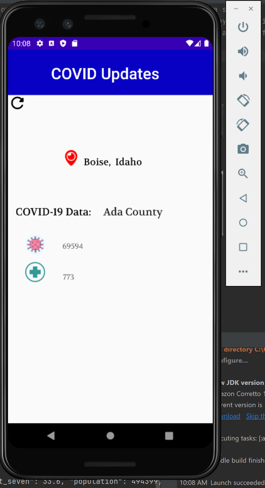

<!--
*** Thanks for checking out the Best-README-Template. If you have a suggestion
*** that would make this better, please fork the repo and create a pull request
*** or simply open an issue with the tag "enhancement".
*** Don't forget to give the project a star!
*** Thanks again! Now go create something AMAZING! :D
-->

<!-- PROJECT SHIELDS -->
<!--
*** I'm using markdown "reference style" links for readability.
*** Reference links are enclosed in brackets [ ] instead of parentheses ( ).
*** See the bottom of this document for the declaration of the reference variables
*** for contributors-url, forks-url, etc. This is an optional, concise syntax you may use.
*** https://www.markdownguide.org/basic-syntax/#reference-style-links
-->
[![LinkedIn][linkedin-shield]][linkedin-url]

<!-- PROJECT LOGO -->
 

  

<h1 align="center">COVID-19 Updates App</h1>

  

    Application that allows users from Idaho, Oregon, and Washington to view COVID-19 data based on the county their device is located in.
    Backend API built with Python, Flask, PostgreSQL, and Heroku. Android application built with Android Studio and Java. 
     
     
  

<a href="#demo">Demo</a>

 

## ***This readme is WIP***
 

<!-- ABOUT THE PROJECT -->
# About The Project
Application consisting of a backend server and an Android App. As a whole, the application allows users from three states (ID, OR, WA) to view COVID-19 data based on which county they are located in.

### **How does everything connect?**

### Server
The backend Python server has two main utilities. 

First, once a day the python server scrapes each states' website for COVID-19 data. This data is mutated into a common form, and then sent to the Postgres database. 
Second, the Python server then has a public facing API. Users can hit the endpoint(s) and query the database for COVID-19 data for a whole state, or state and county. The resulting data is then returned to the user in JSON format. 

The python server is hosted on the cloud provider Heroku, providing a public API. 

### State: **api/Idaho**

    [ 
      { 
          "state":"Idaho", 
          "county":"Ada", 
          "cases":69594, 
          "deaths":773, 
          "last_seven":33.6, 
          "population":494399, 
          "rate":16400.114077901 
      }, 
      { 
          "state":"Idaho", 
          "county":"Adams", 
          "cases":423, 
          "deaths":12, 
          "last_seven":33.3, 
          "population":4447, 
          "rate":11828.198785698 
      }, 
      ...
      ...
      ...
      {
          "state":"Idaho",
          "county":"Washington",
          "cases":1257,
          "deaths":46,
          "last_seven":40.6,
          "population":10360,
          "rate":18069.498069498
      }
    ]

### State and County: **api/Idaho/Ada**

    [ 
      { 
          "state":"Idaho", 
          "county":"Ada", 
          "cases":69594, 
          "deaths":773, 
          "last_seven":33.6, 
          "population":494399, 
          "rate":16400.114077901 
      }
    ]

### Application
The Android application built with Java runs through multiple steps when launched. 

The gps coordinates of a user's phone are retrieved, and sent to the [Nomatim API](https://nominatim.org/release-docs/latest/api/Overview/) to lookup the corresponding state and county. The data is sent back as a JSON response, and is parsed in the app. Once the state and county are extracted, then these are combined with the server URL to hit the API endpoint (`api/Idaho/ada`).

The JSON response from the server is then parsed through, and the data is displayed on screen, along with the current location. 

 

### **App screenshot - Ada County Location**

(<a href="#top">back to top</a>)

# Built With

### **Server** : Python, Flask, PostgreSQL, Heroku
### **Client** : Java, Android Studio

(<a href="#top">back to top</a>)

# Demo

    

(<a href="#top">back to top</a>)

<!-- CONTACT -->
# Contact

### Alex Peña - alexpena5635@gmail.com

### Project Link: [https://github.com/alexpena5635/COVID-Updates](https://github.com/alexpena5635/COVID-Updates)

(<a href="#top">back to top</a>)

<!-- MARKDOWN LINKS & IMAGES -->
<!-- https://www.markdownguide.org/basic-syntax/#reference-style-links -->
[linkedin-shield]: https://img.shields.io/badge/-LinkedIn-black.svg?style=for-the-badge&logo=linkedin&colorB=555
[linkedin-url]: https://www.linkedin.com/in/alex-peña-944095241 
